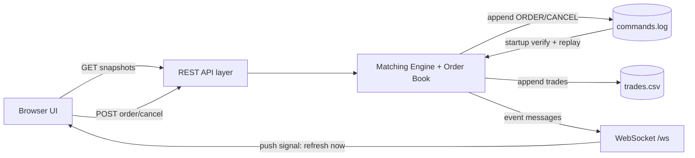

# Trading Engine

Deterministic limit order matching engine in Java (Gradle + Jetty) with persistent command logging, replay-based recovery, REST snapshots, WebSocket push, and Docker/AWS deployment.

This project is backend-first. The browser UI is intentionally thin and reconstructs state from server snapshots.

## Project Overview

This service accepts `BUY`/`SELL` limit orders and cancellations, matches orders using price-time priority, persists accepted commands, and can recover state after restart by replaying the command log.

Key behavior:

- **HTTP snapshots are the source of truth** (`/api/book`, `/api/trades`).
- **WebSockets are push signals only** (`/ws` tells clients to refetch snapshots).
- Matching supports **price-time priority**, **partial fills**, and **multi-order sweeps**.
- Persistence is handled through an append-only write-ahead command log (`commands.log`) plus derived trade history (`trades.csv`).

Main endpoints:

- Ops: `/health`, `/ready`, `/metrics`
- Trading APIs: `POST /api/order`, `POST /api/cancel`, `GET /api/book`, `GET /api/trades`
- UI: `/ui`
- WebSocket: `/ws`

## Architecture

### Core design

- **Matching engine core**: `MatchingEngine` executes crossing logic and updates the order book.
- **Order book model**:
  - Price priority by side (`BUY` descending, `SELL` ascending)
  - FIFO queue per price level
- **Write-ahead command log**:
  - Accepted commands are appended to `commands.log`
  - Log records are hash-chained (`prevHash`, `hash`)
- **Tamper-evident verification**:
  - On startup, command log chain is verified before replay
  - Startup fails fast on chain mismatch/corruption
- **Replay on startup**:
  - `trades.csv` is cleared
  - Command log is replayed into engine state
  - Readiness flips to `READY` only after replay finishes
- **REST + WebSocket separation**:
  - REST serves current snapshots and command endpoints
  - WebSocket broadcasts event signals
- **UI snapshot reconstruction**:
  - UI never keeps authoritative trading state
  - On push, it refetches `/api/book` and `/api/trades`



## Key Engineering Features

- Deterministic matching with price-time FIFO priority.
- Partial fills and multi-order execution across one or more price levels.
- Cancel semantics with safe handling of unknown or already-filled IDs (no mutation when cancel is invalid).
- Snapshot-based UI consistency (no client-side trading state authority).
- Append-only command log persistence with startup replay.
- Tamper-evident hash chain verification on command history.
- Dockerized deployment with persistent volume support.
- Operational endpoints for liveness/readiness/metrics.
- Modular frontend structure (`api.js`, `render.js`, `ws.js`, `app.js`) to separate transport, rendering, and orchestration concerns.

## Edge Case Handling

- **Multiple orders at same price**: executed FIFO by arrival order within that level.
- **Partial fills**: remaining quantity stays resting and can continue matching later.
- **Unknown cancel ID**: cancel returns not found; engine state and command log remain unchanged.
- **Canceling already filled order**: safely returns false; no duplicate cancel command is persisted.
- **UI consistency on refresh**: page rebuilds from `/api/book` and `/api/trades` snapshots, not local memory.
- **Server restart**: command log is verified then replayed to reconstruct deterministic engine state.

## Reproducible Demo

Prerequisites:

- Docker
- `curl`
- Optional: `jq` (for easier JSON parsing)

### 1) Start engine in Docker with persistent data

```bash
docker build -t trading-engine:dev .
mkdir -p docker-data

docker run -d --name trading-engine \
  -p 8080:8080 \
  -e DATA_DIR=/data \
  -v "$(pwd)/docker-data:/data" \
  trading-engine:dev
```

Windows PowerShell path variant:

```powershell
docker run -d --name trading-engine `
  -p 8080:8080 `
  -e DATA_DIR=/data `
  -v "${PWD}/docker-data:/data" `
  trading-engine:dev
```

### 2) Verify service status

```bash
BASE=http://localhost:8080
curl -s $BASE/health
curl -s $BASE/ready
curl -s $BASE/metrics
```

### 3) Demonstrate FIFO + partial fill

Create three SELL orders at the same price:

```bash
S1=$(curl -s -X POST "$BASE/api/order" -H "Content-Type: application/json" \
  -d '{"side":"SELL","price":101,"quantity":4}' | jq -r '.orderId')
S2=$(curl -s -X POST "$BASE/api/order" -H "Content-Type: application/json" \
  -d '{"side":"SELL","price":101,"quantity":4}' | jq -r '.orderId')
S3=$(curl -s -X POST "$BASE/api/order" -H "Content-Type: application/json" \
  -d '{"side":"SELL","price":101,"quantity":4}' | jq -r '.orderId')
echo "$S1 $S2 $S3"
```

Check FIFO queue order at that level:

```bash
curl -s "$BASE/api/book" | jq '.asks[] | select(.price==101) | {price, qty, count, orders}'
```

Submit a BUY for quantity `6` at `101` (fills first order and partially fills second):

```bash
curl -s -X POST "$BASE/api/order" -H "Content-Type: application/json" \
  -d '{"side":"BUY","price":101,"quantity":6}' | jq
```

Verify remaining queue at `101` is still FIFO (`S2` then `S3`):

```bash
curl -s "$BASE/api/book" | jq '.asks[] | select(.price==101) | .orders'
```

### 4) Test cancel behavior

Cancel known order ID:

```bash
curl -s -X POST "$BASE/api/cancel" -H "Content-Type: application/json" \
  -d "{\"orderId\":\"$S2\"}" | jq
```

Cancel unknown ID (safe failure):

```bash
curl -i -s -X POST "$BASE/api/cancel" -H "Content-Type: application/json" \
  -d '{"orderId":"does-not-exist"}'
```

Expected: HTTP `404` and no state mutation.

### 5) Verify snapshot authority in UI

1. Open `http://localhost:8080/ui` in two tabs.
2. Submit/cancel in one tab.
3. Observe the other tab updates after WebSocket push.
4. Reload either tab; state is reconstructed from HTTP snapshots (`/api/book`, `/api/trades`).

### 6) Optional: restart container to demonstrate recovery

```bash
docker restart trading-engine
curl -s "$BASE/ready"
curl -s "$BASE/api/book" | jq
```

Because `/data` is persisted, state is rebuilt from `commands.log` replay.

## Running Locally

Prerequisite: Java 21.

```bash
./gradlew :app:run
```

Run tests:

```bash
./gradlew test
```

Windows:

```bat
gradlew.bat :app:run
gradlew.bat test
```

## Docker Deployment

Build image:

```bash
docker build -t trading-engine:dev .
```

Run with bind mount (host folder persistence):

```bash
mkdir -p docker-data
docker run --rm -p 8080:8080 \
  -e DATA_DIR=/data \
  -v "$(pwd)/docker-data:/data" \
  trading-engine:dev
```

Run with named volume:

```bash
docker volume create trading_engine_data
docker run --rm -p 8080:8080 \
  -e DATA_DIR=/data \
  -v trading_engine_data:/data \
  trading-engine:dev
```

## AWS EC2 Deployment

Minimal EC2 flow:

1. Launch an EC2 instance (Ubuntu) and allow inbound TCP `8080` in the security group.
2. Install Docker and clone the repo.
3. Build and run the container with a persistent host directory mounted to `/data`.

Example:

```bash
sudo apt-get update
sudo apt-get install -y docker.io git
sudo systemctl enable --now docker

git clone <your-repo-url>
cd trading-engine
docker build -t trading-engine:prod .

mkdir -p ~/trading-engine-data
docker run -d --name trading-engine \
  -p 8080:8080 \
  -e DATA_DIR=/data \
  -v ~/trading-engine-data:/data \
  trading-engine:prod
```

Access:

- `http://<EC2_PUBLIC_IP>:8080/ui`

## Testing

This project includes unit and integration tests for matching behavior, persistence, and recovery:

- FIFO and price-priority matching
- Partial fills and multi-level sweeps
- Cancel behavior and invalid ID handling
- Command log replay determinism
- Tamper-evident hash-chain validation and corruption detection
- WebSocket broadcaster behavior

Run all tests with:

```bash
./gradlew test
```

## What This Project Demonstrates

- Backend system design beyond UI concerns.
- Deterministic state reconstruction from an append-only command history.
- Snapshot reconciliation model (`HTTP snapshots + WebSocket push signal`).
- Cloud-friendly deployment using Docker and persistent volumes.
- Operational thinking: health/readiness/metrics, restart behavior, and recovery guarantees.
